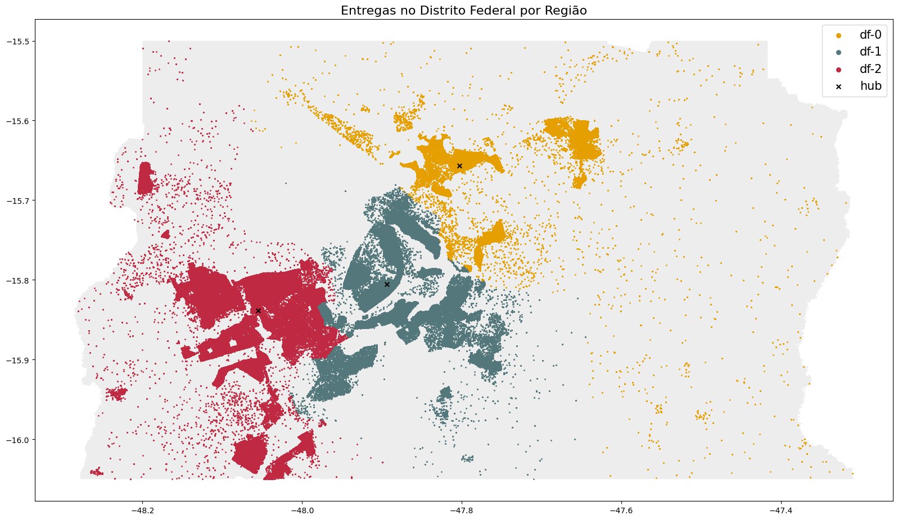
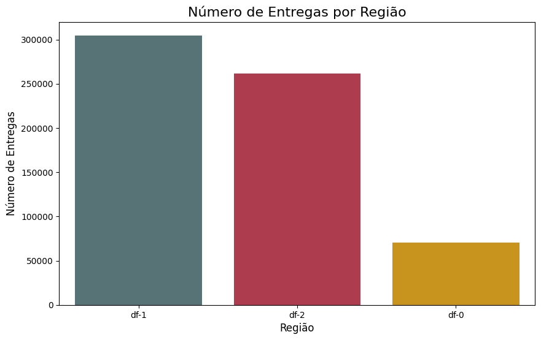
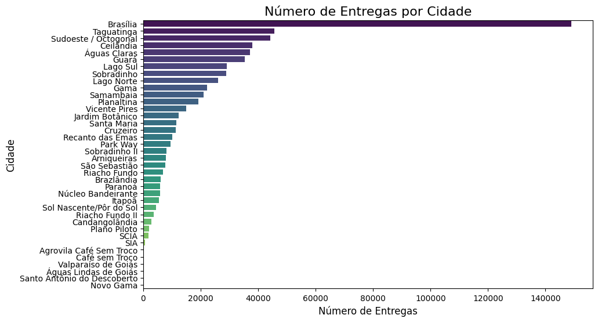
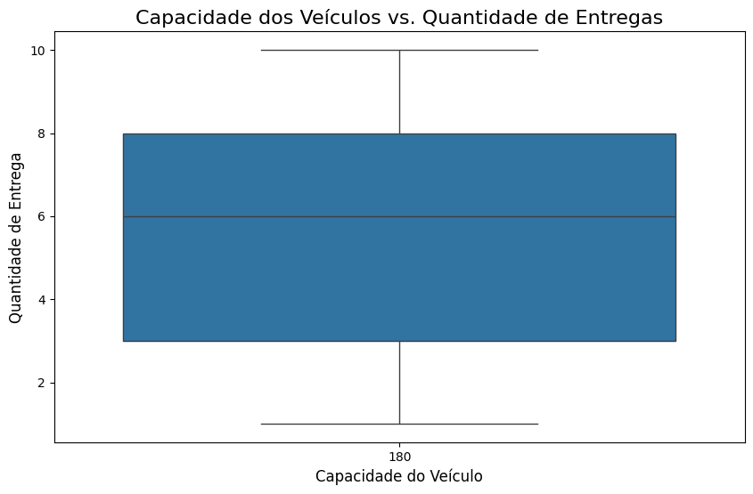
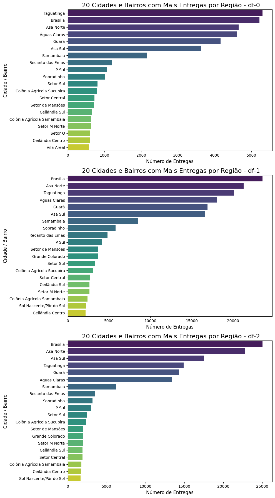

<!DOCTYPE html>
<html>

 <link rel="stylesheet" href="styles.css">
<body>
    <h1>Análise Exploratória de Dados: Empresa Loggi</h1>
    
    <h2>1.0 Introdução ao problema de neǵocios</h2>
     <h3>1.1 Metas e objetivos</h3>
    
O projeto de análise exploratória de dados foi realizado para a empresa Loggi, uma startup brasileira de logística. O objetivo foi entender e otimizar os desafios logísticos enfrentados pela empresa, com foco em rotas de entrega e a alocação de pedidos em veículos com capacidade limitada.
     Os dados estão disponibilizados no github através do <a href="https://github.com/loggi/loggibud" target="_blank">(link)</a> com dados e códigos para problemas típicos que empresas de logística enfrentam: 

 <h2>2. Dados </h2>
 <h3>2.1 Coleta</h3> Vamos trabalhar com um sub conjunto dos dados originais presentes neste <a href="https://github.com/loggi/loggibud">(link)</a>. Em especial, consolidei em um único arquivo JSON as instâncias de treino de cvrp da cidade de Brasília.
 O dado bruto é um arquivo do tipo JSON com uma lista de instâncias de entregas. Cada instância representa um conjunto de entregas que devem ser realizadas pelos veículos do hub regional. Exemplo:</h3>

 
Onde:

    <ul>
        <li><strong>name:</strong> uma string com o nome único da instância;</li>
        <li><strong>region:</strong> uma string com o nome único da região do hub;</li>
        <li><strong>origin:</strong> um dict com a latitude e longitude da região do hub;</li>
        <li><strong>vehicle_capacity:</strong> um int com a soma da capacidade de carga dos veículos do hub;</li>
        <li><strong>deliveries:</strong> uma list de dict com as entregas que devem ser realizadas.</li>
    </ul>
  
Sendo que:

    <ul>
        <li><strong>id:</strong> uma string com o id único da entrega;</li>
        <li><strong>point:</strong> um dict com a latitude e longitude da entrega;</li>
        <li><strong>size:</strong> um int com o tamanho ou a carga que a entrega ocupa no veículo.</li>
    </ul> 
<h2>3. Resultados</h2>
<h3>3.1 Insights da Análise Exploratória  de dados em Python</h3>

 
<ul>
  <li>
<b>Identificação de Áreas de Alta Demanda:</b>
</li>

<b>Insight:</b><b> Regiões df-0, df-1 e df-2</b> cidades como Brasília, Taguatinga, Asa Norte, e Águas Claras têm o maior número de entregas.

<b>Sugestão de Ação:</b> Focar em otimizar as operações nessas áreas de alta demanda, alocando mais recursos, como veículos e pessoal, para garantir entregas mais rápidas e eficientes.

<li><b>Planejamento de Recursos:</b>
</li>

<b>Insight:</b> A diferença no número de entregas entre as cidades e bairros sugere que a alocação de recursos pode ser ajustada para melhor atender à demanda.

<b>Sugestão de Ação:</b> Redistribuir a frota de veículos e a alocação de motoristas com base na demanda específica de cada cidade e bairro. Isso ajudará a evitar a subutilização ou sobrecarga de recursos em determinadas áreas.

<li><b>Oportunidades de Expansão:</b>
</li>

<b>Insight:</b> Cidades e bairros com um número significativo de entregas, mas que não estão no topo da lista, podem representar oportunidades de crescimento.

<b>Sugestão de Ação:</b> Investigar essas áreas para entender melhor as necessidades dos clientes e considerar a expansão dos serviços ou a abertura de novos hubs para atender melhor essas áreas.

<li><b>Eficiência Operacional:</b>
</li>

<b>Insight:</b> Analisar a eficiência das entregas nas áreas de maior demanda pode revelar oportunidades de melhoria.

<b>Sugestão de Ação:</b> Implementar tecnologias de otimização de rotas e monitoramento em tempo real para melhorar a eficiência das entregas. Isso pode incluir o uso de algoritmos de roteamento e sistemas de gestão de transporte (TMS).

<li><b>Utilização da Capacidade dos Veículos:</b>
</li>

<b>Insight:</b> A análise da capacidade dos veículos em relação ao tamanho das entregas mostrou que há uma correlação positiva, indicando uma utilização eficiente dos veículos.

<b>Sugestão de Ação:</b> Continuar monitorando a utilização dos veículos para garantir que eles estejam sendo usados de maneira eficiente. Ajustar a alocação de pedidos para maximizar a capacidade dos veículos pode ajudar a reduzir custos operacionais.

<li><b>Satisfação do Cliente:</b>
</li>

<b>Insight</b> Áreas com alta demanda de entregas são críticas para a satisfação do cliente.

<b>Sugestão de Ação:</b> Garantir que as entregas nessas áreas sejam rápidas e confiáveis. Implementar sistemas de feedback do cliente para monitorar a satisfação e resolver problemas rapidamente.

  
<h2>4. Ferramentas utilizadas</h2>

<h3>4.1 Bilbliotecas Python utilizadas</h3>
<h3> Manipulação de dados</h3>

<h3> EDA</h3>

<h1>5. Exploratory Data Analysis</h1>
 
 
<b>Insight</b>
 
O gráfico fornece uma visão geral da distribuição espacial das entregas no Distrito Federal observando-se maior número de demanda próximo aos HUB´s de distribuição. 

  
   
<b>Insight</b>
Desigualdade na Demanda: A região df-1 apresenta o maior volume de entregas, seguida pela df-2 e, por fim, pela df-0. Essa disparidade indica que a demanda por entregas varia significativamente entre as diferentes regiões do DF.

   
    
<b>Insight</b>
Dominância de Brasília e Taguatinga: Essas duas cidades juntas representam uma parcela significativa do total de entregas, indicando uma alta demanda por serviços de entrega nessas áreas.

    
   
<b>Insight</b>
A concentração das entregas em torno de 6 unidades por veículo, mesmo com uma capacidade média de 180 unidades, indica que a capacidade dos veículos pode não estar sendo totalmente utilizada.

     
     
<b>Insight</b>
Concentração em Poucas Áreas: É evidente uma concentração significativa do volume de entregas em algumas cidades e bairros específicos de cada região. Por exemplo, Brasilia ficando em primeiro lugar na região (df-1 e df-2) em segundo lugar Asa Norte (df-1 e df-2) e em terceiro  Taguatinga pela região também de (df-1 e df-2),indicando uma demanda substancial por serviços de entrega nessas localidades.

</body>
</html>
