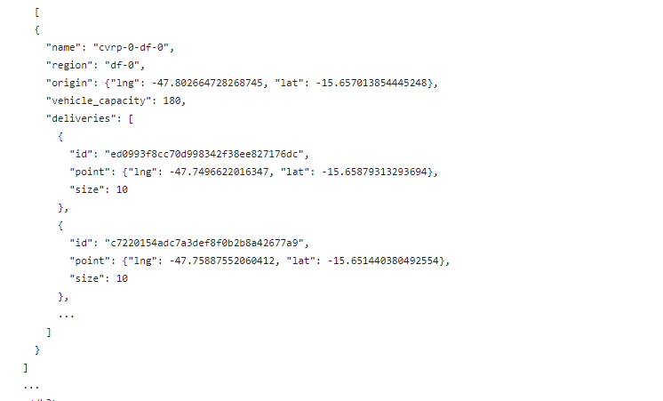

<!DOCTYPE html>
<html>

 <link rel="stylesheet" href="styles.css">
<body>
    <h1>Análise Exploratória de Dados: Empresa Loggi</h1>
    
    <h2>Introdução ao problema de neǵocios</h2>
    
O projeto de análise exploratória de dados foi realizado para a empresa Loggi, uma startup brasileira de logística. O objetivo foi entender e otimizar os desafios logísticos enfrentados pela empresa, como a com foco em rotas de entrega e a alocação de pedidos em veículos com capacidade limitada.
     Os dados estão disponibilizados no github através do <a href="https://github.com/loggi/loggibud" target="_blank">(link)</a> com dados e códigos para problemas típicos que empresas de logística enfrentam: 

 <h2>1.Dados</h2>
 <h3>1.1 Atenção</h3> Vamos trabalhar com um sub conjunto dos dados originais presentes neste <a href="https://github.com/loggi/loggibud">(link)</a>. Em especial, consolidei em um único arquivo JSON as instâncias de treino de cvrp da cidade de Brasília.
 O dado bruto é um arquivo do tipo JSON com uma lista de instâncias de entregas. Cada instância representa um conjunto de entregas que devem ser realizadas pelos veículos do hub regional. Exemplo:</h3>

 
Onde:

    <ul>
        <li><strong>name:</strong> uma string com o nome único da instância;</li>
        <li><strong>region:</strong> uma string com o nome único da região do hub;</li>
        <li><strong>origin:</strong> um dict com a latitude e longitude da região do hub;</li>
        <li><strong>vehicle_capacity:</strong> um int com a soma da capacidade de carga dos veículos do hub;</li>
        <li><strong>deliveries:</strong> uma list de dict com as entregas que devem ser realizadas.</li>
    </ul>
  
Sendo que:

    <ul>
        <li><strong>id:</strong> uma string com o id único da entrega;</li>
        <li><strong>point:</strong> um dict com a latitude e longitude da entrega;</li>
        <li><strong>size:</strong> um int com o tamanho ou a carga que a entrega ocupa no veículo.</li>
    </ul>
 <h2>2.Exploração de Dados</h2>
 <h3>3.1. Coleta</h3>
O dado bruto é um arquivo do tipo JSON com uma lista de instâncias de entregas. Cada instância representa um conjunto de entregas que devem ser realizadas pelos veículos do hub regional. Exemplo:

 
<h2>Resultados:</h2>
 
<h2>Insights da Análise Exploratória:</h2>

<h2>Ferramentas utilizadas:</h2>
</body>
</html>
